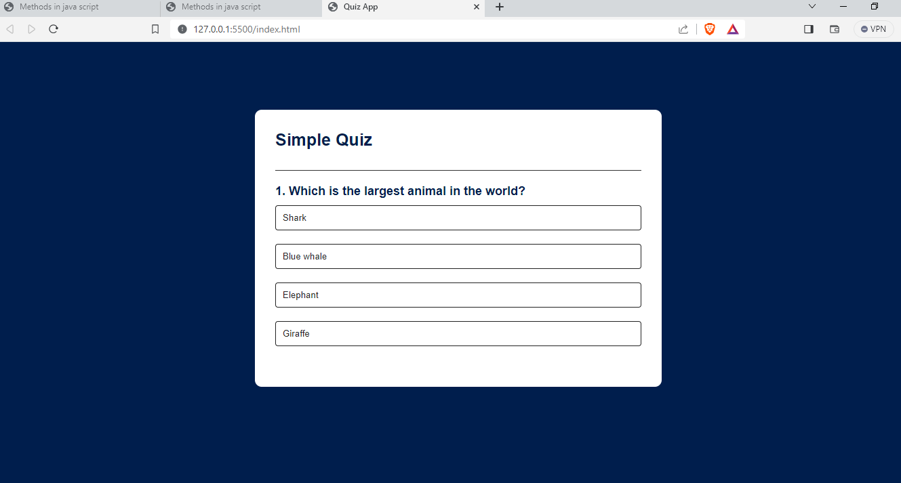

# Online-quiz-platform



Brief description of your project. You can also include a logo or a banner image here.

## Table of Contents

- [Introduction](#introduction)
- [Features](#features)
- [Getting Started](#getting-started)
  - [Prerequisites](#prerequisites)
  - [Installation](#installation)
- [Usage](#usage)
- [Contributing](#contributing)
- [License](#license)

## Introduction

Provide a high-level overview of your project. Explain what it does, why it's useful, and what problem it solves. You can also mention any unique or standout features.

## Features

List the key features and functionalities of your project. Use bullet points for clarity.

- Feature 1
- Feature 2
- ...

## Getting Started

Explain how to get your project up and running. This section should guide users through the setup process.

### Prerequisites

List any software, libraries, or dependencies that users need to have installed before they can use your project.

```markdown
Example:

- Node.js
- MongoDB
- ...
Installation
Provide step-by-step instructions on how to install and configure your project.

bash

# Clone the repository
git clone https://github.com/surajkumarpandey231211/Online-quiz-platform.git

# Change directory
cd Online-quiz-platform

# Install dependencies
npm install

Example:

To start the development server, run:

```bash
npm start
Visit http://localhost:3000 in your web browser.

